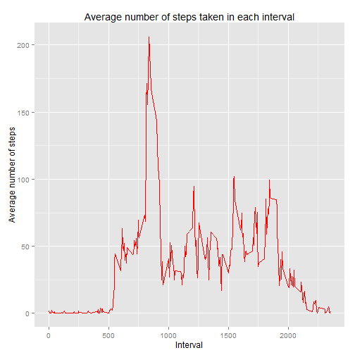

#Programming Assignment no. 1 - Reproducible Research

Author: Maciek

##Loading and preprocessing the data

Code below reads data - each column as indicated class


```r
setwd("C:/Users/Maciek/Desktop/ReprResearch/repdata_data_activity")
classes = c('integer','Date','factor')
data<-read.csv('activity.csv',colClasses = classes)
```

##What is mean total number of steps taken per day?

code below, ignoring the missing values, calculates total number of steps taken
each day, plots histogram and calculates mean and median of total number
of steps taken each day


```r
data.complete<-data[complete.cases(data),]
steps_bydate<-aggregate(data.complete$steps,by=list(group_by_date=data.complete$date),FUN=sum)
print('The data aggegated on a daily basis is presented below')
```

```
## [1] "The data aggegated on a daily basis is presented below"
```

```r
steps_bydate
```

```
##    group_by_date     x
## 1     2012-10-02   126
## 2     2012-10-03 11352
## 3     2012-10-04 12116
## 4     2012-10-05 13294
## 5     2012-10-06 15420
## 6     2012-10-07 11015
## 7     2012-10-09 12811
## 8     2012-10-10  9900
## 9     2012-10-11 10304
## 10    2012-10-12 17382
## 11    2012-10-13 12426
## 12    2012-10-14 15098
## 13    2012-10-15 10139
## 14    2012-10-16 15084
## 15    2012-10-17 13452
## 16    2012-10-18 10056
## 17    2012-10-19 11829
## 18    2012-10-20 10395
## 19    2012-10-21  8821
## 20    2012-10-22 13460
## 21    2012-10-23  8918
## 22    2012-10-24  8355
## 23    2012-10-25  2492
## 24    2012-10-26  6778
## 25    2012-10-27 10119
## 26    2012-10-28 11458
## 27    2012-10-29  5018
## 28    2012-10-30  9819
## 29    2012-10-31 15414
## 30    2012-11-02 10600
## 31    2012-11-03 10571
## 32    2012-11-05 10439
## 33    2012-11-06  8334
## 34    2012-11-07 12883
## 35    2012-11-08  3219
## 36    2012-11-11 12608
## 37    2012-11-12 10765
## 38    2012-11-13  7336
## 39    2012-11-15    41
## 40    2012-11-16  5441
## 41    2012-11-17 14339
## 42    2012-11-18 15110
## 43    2012-11-19  8841
## 44    2012-11-20  4472
## 45    2012-11-21 12787
## 46    2012-11-22 20427
## 47    2012-11-23 21194
## 48    2012-11-24 14478
## 49    2012-11-25 11834
## 50    2012-11-26 11162
## 51    2012-11-27 13646
## 52    2012-11-28 10183
## 53    2012-11-29  7047
```

```r
hist(steps_bydate$x,main='Histogram of steps taken each day',xlab='steps taken each day',breaks=4,col='green')
```

 

```r
mean<-mean(steps_bydate$x)
median<-median(steps_bydate$x)
print(paste0("Average number of steps per day: ", mean))
```

```
## [1] "Average number of steps per day: 10766.1886792453"
```

```r
print(paste0("Median number of steps per day: ", median))
```

```
## [1] "Median number of steps per day: 10765"
```

##What is the average daily activity pattern?


```r
suppressWarnings(library(dplyr))
suppressWarnings(library(ggplot2))
data_table<-tbl_df(data) #uses data table from dplyr for ease 
#of data manipulation
#sorts levels of intervasls ni ascending order
levels<-levels(data_table$interval)
levels<-as.numeric(levels)
levels<-sort(levels)
levels<-as.character(levels)

#assigning new levels of factors in ascending order
data_table$interval <- factor(data_table$interval, levels = levels)

by_interval<-group_by(data_table,interval)
avg_steps<-summarise(by_interval,avg_steps=mean(steps,na.rm=TRUE))

#plotting the data
ggplot(avg_steps, aes(x=as.integer(as.character(interval)),y=avg_steps))+geom_line(aes(group=1),colour="red")+labs(title='Average number of steps taken in each interval',x='Interval',y='Average number of steps')
```

 

```r
#finding interval with maximum number of steps

results = filter(avg_steps,avg_steps==max(avg_steps))
print('Below is maximum average number of steps and interval')
```

```
## [1] "Below is maximum average number of steps and interval"
```

```r
results
```

```
## Source: local data frame [1 x 2]
## 
##   interval avg_steps
##     (fctr)     (dbl)
## 1      835  206.1698
```

##Imputing missing values


```r
missing.values=dim(data)[1]-dim(data.complete)[1]
print(paste0("Total number of missing values: ", missing.values))
```

```
## [1] "Total number of missing values: 2304"
```

```r
#imputing missing values - using average for interval
merged<-inner_join(data_table,avg_steps) 
```

```
## Joining by: "interval"
```

```r
merged[is.na(merged$steps),1]<-as.integer(merged[is.na(merged$steps),4]$avg_steps)
sum(is.na(merged$steps))#check if there are no NAs
```

```
## [1] 0
```

```r
#analyzing imputed data set
steps_bydate2<-aggregate(merged$steps,by=list(group_by_date=merged$date),FUN=sum)
print('The data aggegated on a daily basis is presented below')
```

```
## [1] "The data aggegated on a daily basis is presented below"
```

```r
steps_bydate2
```

```
##    group_by_date     x
## 1     2012-10-01 10641
## 2     2012-10-02   126
## 3     2012-10-03 11352
## 4     2012-10-04 12116
## 5     2012-10-05 13294
## 6     2012-10-06 15420
## 7     2012-10-07 11015
## 8     2012-10-08 10641
## 9     2012-10-09 12811
## 10    2012-10-10  9900
## 11    2012-10-11 10304
## 12    2012-10-12 17382
## 13    2012-10-13 12426
## 14    2012-10-14 15098
## 15    2012-10-15 10139
## 16    2012-10-16 15084
## 17    2012-10-17 13452
## 18    2012-10-18 10056
## 19    2012-10-19 11829
## 20    2012-10-20 10395
## 21    2012-10-21  8821
## 22    2012-10-22 13460
## 23    2012-10-23  8918
## 24    2012-10-24  8355
## 25    2012-10-25  2492
## 26    2012-10-26  6778
## 27    2012-10-27 10119
## 28    2012-10-28 11458
## 29    2012-10-29  5018
## 30    2012-10-30  9819
## 31    2012-10-31 15414
## 32    2012-11-01 10641
## 33    2012-11-02 10600
## 34    2012-11-03 10571
## 35    2012-11-04 10641
## 36    2012-11-05 10439
## 37    2012-11-06  8334
## 38    2012-11-07 12883
## 39    2012-11-08  3219
## 40    2012-11-09 10641
## 41    2012-11-10 10641
## 42    2012-11-11 12608
## 43    2012-11-12 10765
## 44    2012-11-13  7336
## 45    2012-11-14 10641
## 46    2012-11-15    41
## 47    2012-11-16  5441
## 48    2012-11-17 14339
## 49    2012-11-18 15110
## 50    2012-11-19  8841
## 51    2012-11-20  4472
## 52    2012-11-21 12787
## 53    2012-11-22 20427
## 54    2012-11-23 21194
## 55    2012-11-24 14478
## 56    2012-11-25 11834
## 57    2012-11-26 11162
## 58    2012-11-27 13646
## 59    2012-11-28 10183
## 60    2012-11-29  7047
## 61    2012-11-30 10641
```

```r
hist(steps_bydate2$x,main='Histogram of steps taken each day',xlab='steps taken each day',breaks=4,col='red')
```

 

```r
mean2<-mean(steps_bydate2$x)
median2<-median(steps_bydate2$x)
print(paste0("Average number of steps per day: ", mean2))
```

```
## [1] "Average number of steps per day: 10749.7704918033"
```

```r
print(paste0("Median number of steps per day: ", median2))
```

```
## [1] "Median number of steps per day: 10641"
```

##Are there differences in activity patterns between weekdays and weekends?


```r
#Adding new column for weekdays and for weekends
merged<-mutate(merged,day_flag=weekdays(merged$date))
weekday<-unique(merged$day_flag)[1:5]
weekend<-unique(merged$day_flag)[6:7]
merged<-mutate(merged,weekend_flag=ifelse(merged$day_flag %in% weekday, 'weekday', 'weekend'))

#Preparing data for panel plot
grouped<-group_by(merged,weekend_flag,interval)
final<-summarise(grouped,average_steps=mean(steps))

#Making panel plot
suppressWarnings(library(lattice))
xyplot(average_steps~as.integer(as.character(interval))|weekend_flag, type="l", data=final, col="red",main="Panel plot of average number of steps in each interval",xlab= "interval",ylab="average number of steps")
```

 


